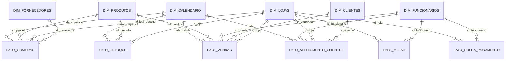

# power_bi

Dataset realista de uma rede de lojas de suplementos para construção de dashboards no Power BI.

## Visão geral

Este repositório gera um conjunto de arquivos Excel de grande volume para simular operações reais de uma rede de lojas de suplementos com múltiplas unidades.

- Script gerador: `scripts/generate_data.py`
- Saída de dados: `data/*.xlsx`
- Reprodutível: `np.random.seed(42)`, `random.seed(42)`, `Faker('pt_BR')`

## Modelo de dados (estrela/floco)



## Tabelas geradas

- `dim_lojas.xlsx` (~15)
- `dim_produtos.xlsx` (~500)
- `dim_fornecedores.xlsx` (~40)
- `dim_clientes.xlsx` (~10.000)
- `dim_funcionarios.xlsx` (~150)
- `dim_calendario.xlsx` (2022-01-01 a 2025-12-31)
- `fato_vendas.xlsx` (~220.000 itens)
- `fato_estoque.xlsx` (~105.000)
- `fato_compras.xlsx` (~5.000)
- `fato_metas.xlsx` (vendedor/gerente por mês)
- `fato_folha_pagamento.xlsx` (funcionário por mês)
- `fato_atendimento_clientes.xlsx` (~20.000)

## Regras de realismo aplicadas

- Sazonalidade de vendas:
  - picos em **janeiro** e **setembro/outubro**
  - quedas em **maio/junho**
  - maior volume em **sexta/sábado**
  - picos de horário em **12h–14h** e **18h–20h**
- Comissões:
  - vendedores: **1% a 4%** sobre valor líquido
  - gerentes: comissão menor + bônus por meta
  - limpeza/segurança/estoquista: sem comissão
- Faixas de preço realistas, incluindo whey e creatina.
- Faixas salariais por cargo compatíveis com operação de varejo.
- Integridade referencial validada no script (todas as FKs existem nas dimensões).

## Como gerar os dados

```bash
python -m venv .venv
source .venv/bin/activate  # Linux/macOS
pip install -r requirements.txt
python scripts/generate_data.py
```

Ao final o script imprime o resumo de linhas por tabela e recria todos os arquivos em `data/`.

## Sugestões de medidas DAX

```DAX
Faturamento Liquido = SUM(fato_vendas[valor_liquido])

Faturamento Bruto = SUM(fato_vendas[valor_bruto])

Ticket Medio = DIVIDE([Faturamento Liquido], DISTINCTCOUNT(fato_vendas[id_venda]))

Margem Bruta = SUM(fato_vendas[margem_bruta_item])

Margem Bruta % = DIVIDE([Margem Bruta], [Faturamento Liquido])

Comissao Paga = SUM(fato_vendas[comissao_calculada])

Itens Vendidos = SUM(fato_vendas[quantidade])

Ruptura % =
DIVIDE(
    CALCULATE(COUNTROWS(fato_estoque), fato_estoque[status_estoque] = "Ruptura"),
    COUNTROWS(fato_estoque)
)

Giro de Estoque = DIVIDE([Itens Vendidos], AVERAGE(fato_estoque[quantidade_em_estoque]))

NPS Medio = AVERAGE(fato_atendimento_clientes[nps])

CAC Estimado = DIVIDE(SUM(fato_folha_pagamento[custo_total_empresa]) * 0.08, DISTINCTCOUNT(dim_clientes[id_cliente]))

LTV Estimado = [Ticket Medio] * AVERAGE(dim_clientes[frequencia_compra_estimada_dias])
```

## KPIs sugeridos

- Faturamento (bruto e líquido)
- Ticket médio
- Margem bruta (%)
- Comissão paga
- Ruptura e excesso de estoque
- Giro de estoque
- Vendas por loja, categoria e marca
- Ranking de produtos
- Conversão por canal de venda
- Meta x Realizado por vendedor/gerente
- Custo de folha por loja
- NPS estimado e taxa de resolução
- CAC estimado
- LTV estimado

## Sugestões de dashboards no Power BI

1. **Visão executiva**
   - Receita, margem, ticket médio, crescimento mensal, mapa por região.
2. **Comercial e produtos**
   - Curva ABC, top/bottom SKUs, sazonalidade por categoria e marca.
3. **Lojas e operação**
   - Performance por loja, ruptura, excesso, cobertura e giro de estoque.
4. **Equipe e metas**
   - Meta x realizado, comissões, bônus, produtividade por vendedor.
5. **Clientes e atendimento**
   - Segmentação de fidelidade, frequência de compra, NPS e motivos de contato.

## Estrutura do projeto

```text
power_bi/
├── README.md
├── requirements.txt
├── scripts/
│   └── generate_data.py
└── data/
    ├── dim_lojas.xlsx
    ├── dim_produtos.xlsx
    ├── dim_fornecedores.xlsx
    ├── dim_clientes.xlsx
    ├── dim_funcionarios.xlsx
    ├── dim_calendario.xlsx
    ├── fato_vendas.xlsx
    ├── fato_estoque.xlsx
    ├── fato_compras.xlsx
    ├── fato_metas.xlsx
    ├── fato_folha_pagamento.xlsx
    └── fato_atendimento_clientes.xlsx
```
